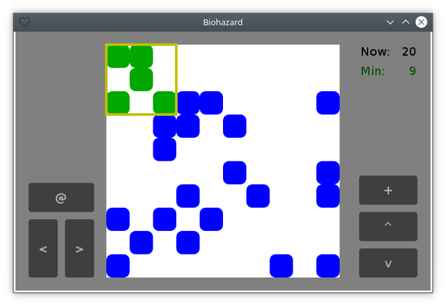

# Controls (EN / [RU](controls_ru.md))

[<< Back](README.md)

Operations with the movable part of the field:

- movement:
  - to the left:
    - via a keyboard: <kbd>Left Arrow</kbd>, <kbd>A</kbd>;
    - via a mouse/a touchscreen: <kbd><</kbd>;
  - to the right:
    - via a keyboard: <kbd>Right Arrow</kbd>, <kbd>D</kbd>;
    - via a mouse/a touchscreen: <kbd>></kbd>;
  - upward:
    - via a keyboard: <kbd>Up Arrow</kbd>, <kbd>W</kbd>;
    - via a mouse/a touchscreen: <kbd>^</kbd>;
  - downward:
    - via a keyboard: <kbd>Down Arrow</kbd>, <kbd>S</kbd>;
    - via a mouse/a touchscreen: <kbd>v</kbd>;
- rotation:
  - via a keyboard: <kbd>Left Shift</kbd>, <kbd>Right Shift</kbd>, <kbd>R</kbd>, <kbd>E</kbd>;
  - via a mouse/a touchscreen: <kbd>@</kbd>;
- merging with the primary field:
  - via a keyboard: <kbd>Enter</kbd>, <kbd>Space</kbd>;
  - via a mouse/a touchscreen: <kbd>+</kbd>.

The keyboard keys can be changed in the `keys_config.json` config. The values are selected based on https://github.com/tesselode/baton#usage.
