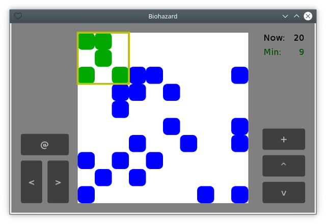

# Summary (EN / [RU](summary_ru.md))

[<< Back](README.md)

The game field is represented by a set of **blue** cells. Above them are the second layer of **green** ones. The player can control this group — move, rotate, and put to the blue ones (only on the free areas). After merging, the cells evolve according to the rules of the ["Life"](https://en.wikipedia.org/wiki/Conway's_Game_of_Life) game for one generation, then new green cells are created. The player's goal is to minimize the amount of blue cells.
